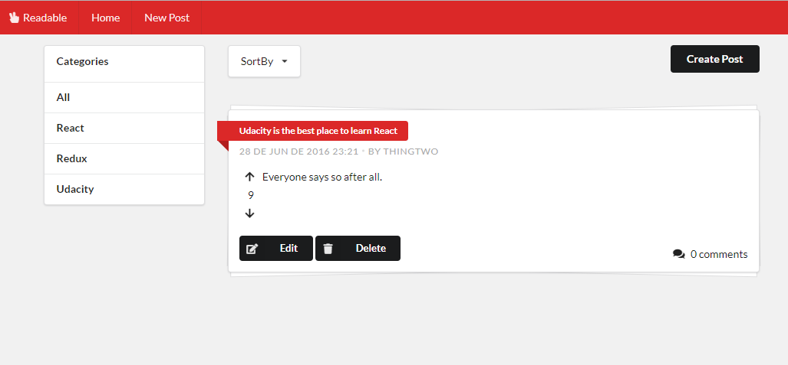

# Readable

A content and comment web app built for the Udacity React Nanodegree program. 
Users will be able to post content to predefined categories, comment on their posts and other users' posts, and vote on posts and comments. U
sers will also be able to edit and delete posts and comments.

### Getting Started

``````
git clone https://github.com/Jansser/readable.git
```

To run the app you need first to start the local backend development server

```
cd readable/api-server
```

```
npm install
```

```
node server.js
```

Then you are ready to start the client app

```
cd readable/frontend

```
npm install
```

```
npm start
```

### TODO
The project still needs some improvements, like:

- Show a Loading when data is loading and form is processing.
- Add some data validation to forms.

